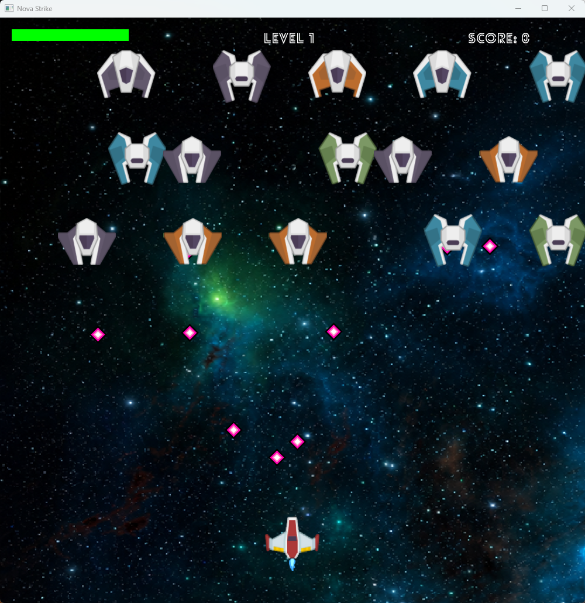
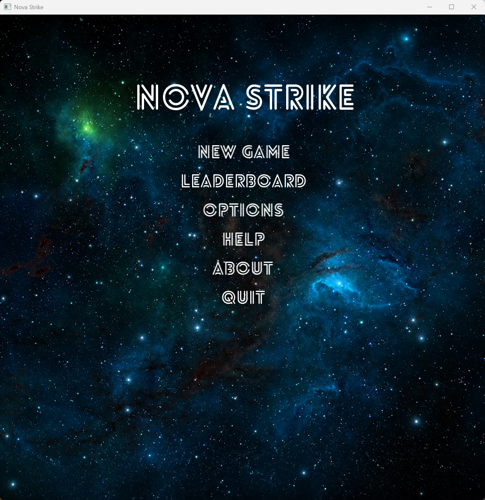
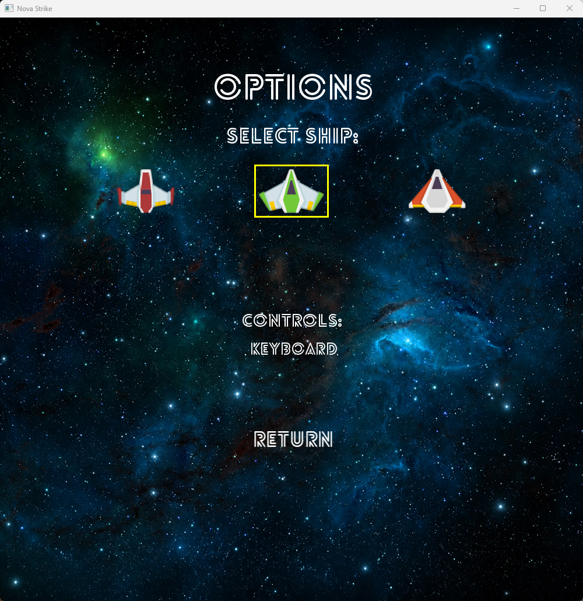
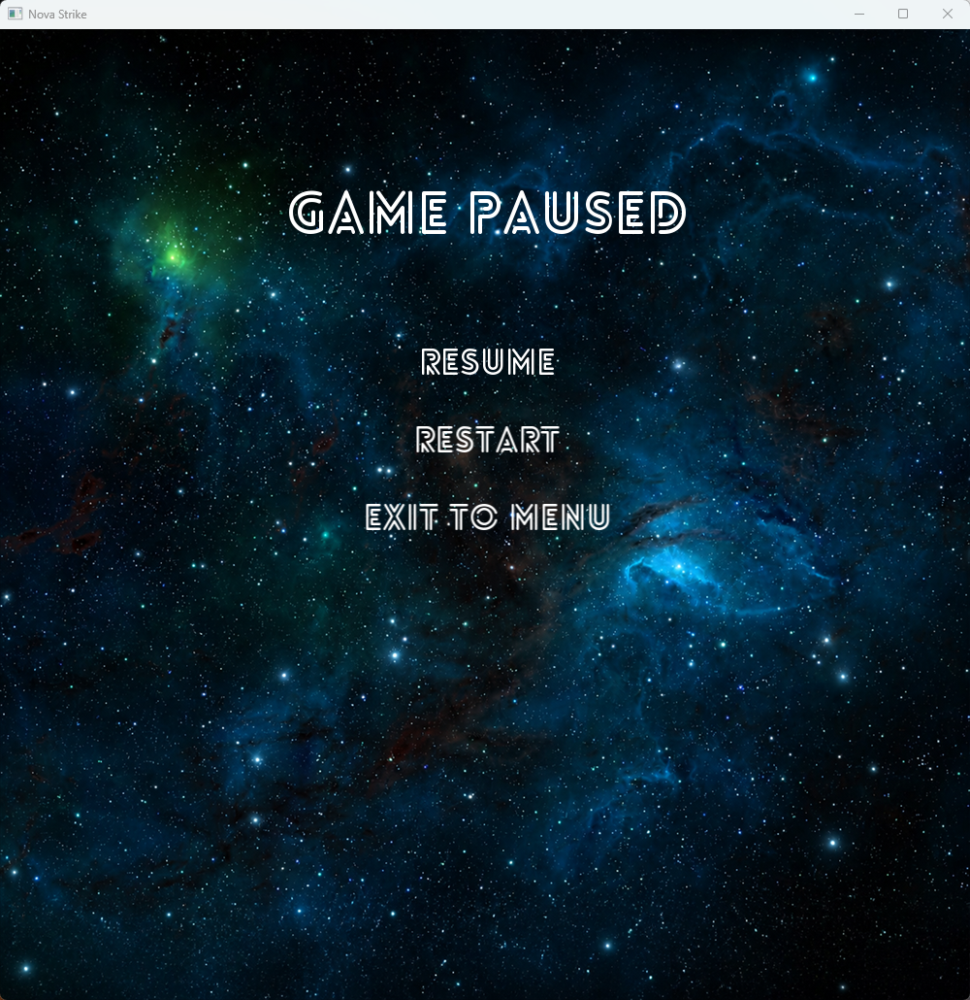
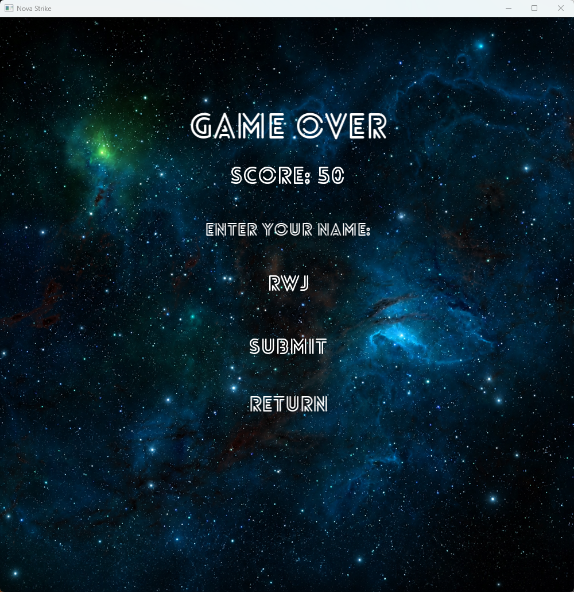

# Nova Strike

**Nova Strike** is a 2D arcade-style space shooter built with C++17 and SFML 3. It combines momentum-based ship controls, data-driven level progression, multiple enemy attack patterns, boss battles, pickups, local saves, and leaderboard support.



## Features

- 60 Hz fixed-timestep simulation with semi-implicit Euler movement
- Unified keyboard and mouse input through `PlayerInput`
- RAII ownership with runtime polymorphism and `std::unique_ptr`
- Three enemy stages, two boss battles, formations, and three selectable ships
- Weighted pickup factory with health, score, piercing-fire, and meteor drops
- Versioned and validated binary saves, resource caching, and a local top-10 leaderboard

## Screenshots

| Main Menu | Options | Pause | Game Over |
|:-:|:-:|:-:|:-:|
|  |  |  |  |

## Controls

| Action | Keyboard | Mouse Mode |
|--------|----------|------------|
| Move | WASD / Arrow Keys | Follow mouse position |
| Fire | Space | Left Click |
| Pause / Resume | Escape | Escape |

## Building

### Requirements

- A C++17-compatible compiler
- CMake 3.24 or newer
- Git and an internet connection for CMake `FetchContent`

SFML 3.0.1 is fetched and statically linked by CMake, so a separate system-wide SFML installation is not required.

### Configure and Build

```bash
cmake -S . -B build
cmake --build build --config Release --parallel
```

On Windows with a multi-configuration generator, run:

```powershell
& "build/bin/Release/Nova Strike.exe"
```

With a single-configuration generator, the executable is written under `build/bin/`.

## Project Structure

```text
src/
|-- main.cpp                        # Application entry point
|-- app/
|   `-- Game.cpp/hpp                # Main loop, game states, and orchestration
|-- config/
|   `-- GameConfig.hpp              # Shared window and world dimensions
|-- core/
|   `-- ResourceManager.hpp         # Header-only texture and font cache
|-- gameplay/
|   `-- LevelManager.cpp/hpp        # Level table, formations, bosses, progression
|-- input/
|   `-- PlayerInput.hpp             # Input abstraction shared by control modes
|-- ui/
|   |-- Menu.cpp/hpp                # Shared controls, main menu, and pause menu
|   |-- MenuInfo.cpp                # Leaderboard, help, and about screens
|   |-- MenuOptions.cpp             # Ship and input options screen
|   |-- MenuResults.cpp             # Game-over, victory, and load-error screens
|   `-- Leaderboard.cpp/hpp         # Top-10 score persistence
|-- systems/
|   |-- CollisionSystem.cpp/hpp     # Projectile, bomb, and pickup collisions
|   `-- SaveSystem.cpp/hpp          # Versioned binary save validation and persistence
`-- entities/
    |-- Entity.hpp                  # Polymorphic base entity
    |-- Spaceship.cpp/hpp           # Player movement, firing, health, score
    |-- Bullet.cpp/hpp              # Normal and piercing projectile behavior
    |-- enemies/                    # Invaders, bosses, bombs, attack interfaces
    `-- pickups/                    # Pickup hierarchy and weighted factory
```
